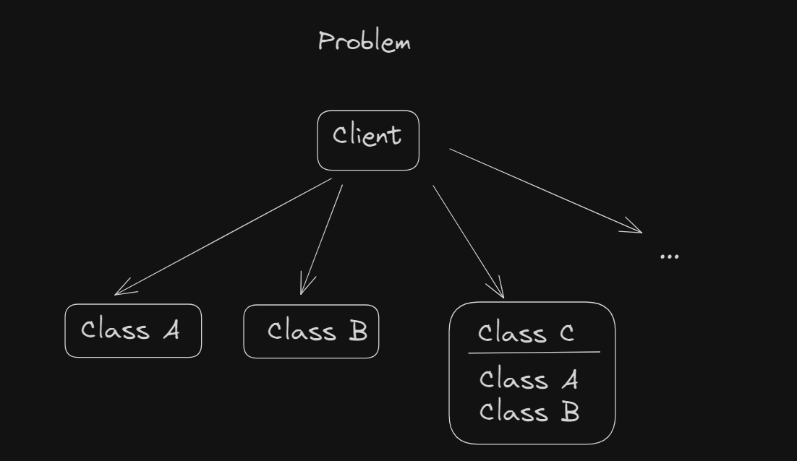

## Composite 

The Composite pattern is a structural design pattern that allows you to compose objects into tree-like structures to represent part-whole hierarchies.
It enables clients to treat individual objects and compositions of objects uniformly.

Design and implement a Java class structure that demonstrates the Composite pattern. 
Your implementation should include the following components:

- **Component Interface:** Define an interface or abstract class that represents both individual objects and compositions of objects. This interface should declare methods for operations that can be performed on both types of objects.
- **Leaf Class:** Implement a leaf class that represents individual objects in the hierarchy. This class should implement the Component interface and provide concrete implementations for its methods.
- **Composite Class:** Implement a composite class that represents compositions of objects. This class should also implement the Component interface and contain a collection of child components. It should delegate operations to its child components as necessary.
- Create a **Client class** to test your implementation of the Composite pattern. The client class should create a tree-like structure of composite and leaf objects and perform operations on this structure using the Component interface.

