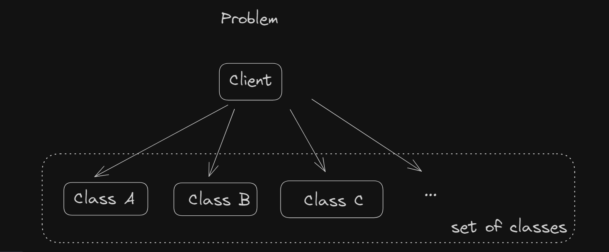
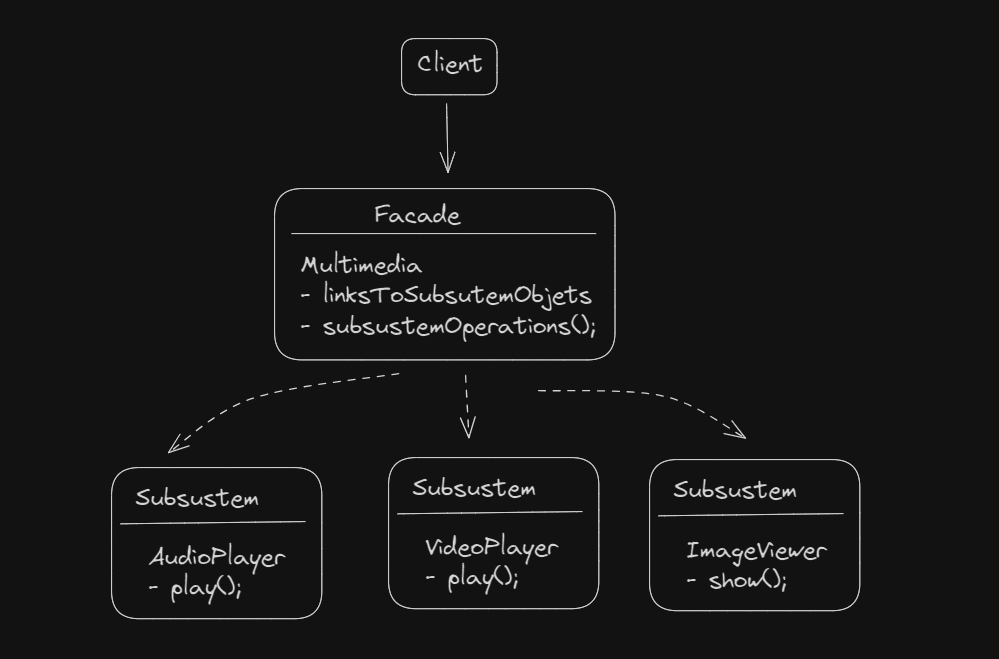

## Facade

The Facade design pattern is a structural pattern that provides a unified interface to a set of interfaces in a subsystem. 
It defines a higher-level interface that makes the subsystem easier to use, hiding its complexity from the client.

**Problem**

Complex subsystem needs to be used by clients, but interacting with individual components of the subsystem is cumbersome or error-prone due to its complexity. 

The Facade pattern addresses these challenges by providing a simplified interface to the subsystem, hiding its complexity from clients.

**Task:** Implement the Facade Design Pattern for Managing Subsystems

**Objective:**

Implement a Facade class that simplifies the usage of multiple subsystems by providing a unified interface.

**Implementation Details:**
- Define several subsystem classes, each responsible for a specific aspect of functionality.
- Implement a Facade class that acts as a single entry point to access the functionalities provided by the subsystems.
- The Facade class should encapsulate the complexity of interacting with individual subsystems and provide high-level methods to perform tasks.

**Use cases:**
- **JDBC API:** The `DriverManager` class in JDBC serves as a Facade for managing database connections. 
It hides the complexities of loading database drivers, establishing connections, and managing transactions.
- **Spring Framework:** In Spring, the `ApplicationContext` interface serves as a Facade for accessing the Spring IoC (Inversion of Control) container and managing beans. 
It abstracts away the complexities of bean instantiation, dependency injection, and lifecycle management.
- **Java Collections Framework:** The `Collections` class provides static methods like `sort()`, `binarySearch()`, and `reverse()` to manipulate collections such as lists, sets, and maps. 
It acts as a Facade for common collection operations, hiding the implementation details of specific collection types.

[Facade design pattern](https://refactoring.guru/design-patterns/facade)