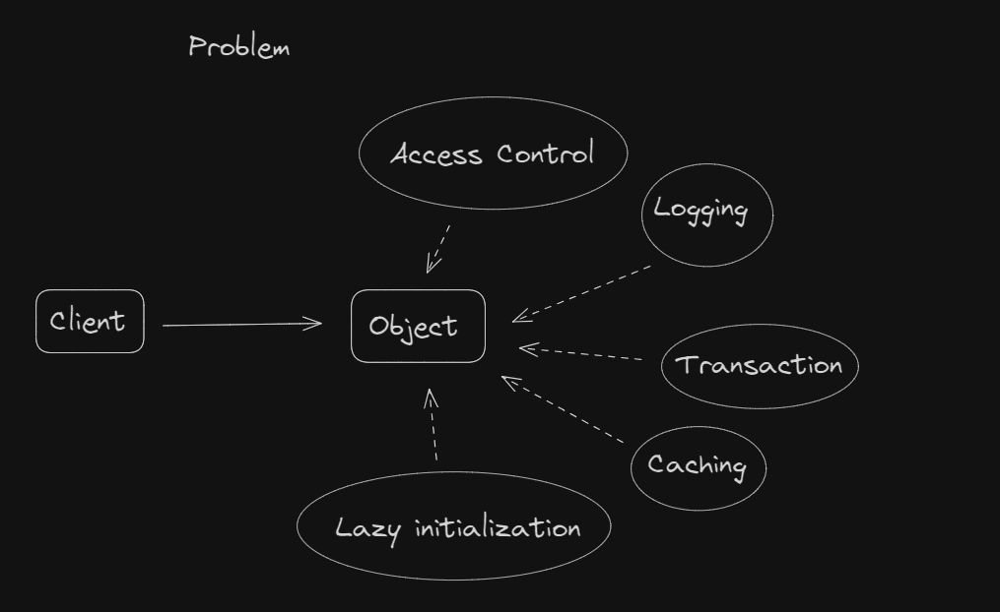
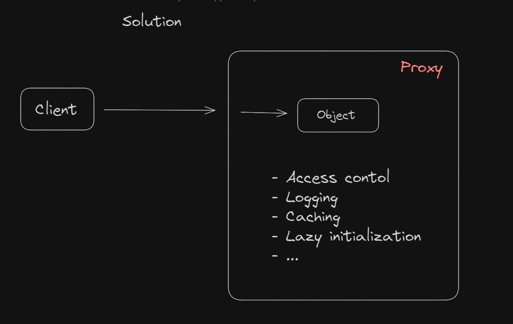
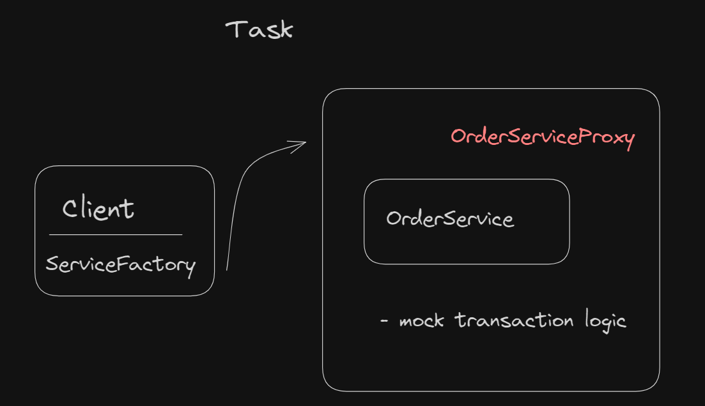

### Proxy Design Pattern

The Proxy design pattern provides a surrogate or placeholder for another object to control access to it. It acts as an intermediary, allowing clients to interact with the real object indirectly through the proxy.

**Key Features:**

- **Access Control:** The proxy can enforce access control policies, restricting access to the real object based on permissions or credentials.

- **Lazy Initialization:** Proxies can defer the creation of the real object until it's actually needed, improving performance by avoiding unnecessary resource allocation.

- **Remote Access:** Proxies can represent objects that reside in remote locations, handling communication details transparently to clients.

- **Logging and Monitoring:** Proxies can intercept method calls to provide logging, monitoring, or auditing functionality, allowing you to track interactions with the real object.

- **Caching:** Proxies can cache results of expensive operations, returning cached results for identical requests to improve performance and reduce resource consumption.

- **Virtual Proxies:** Proxies can provide a simplified interface to complex or resource-intensive objects, loading them only when necessary and providing a lightweight representation in the meantime.

### Task Description: Implement Proxy Design Pattern

#### Objective:
The objective of this task is to implement the Proxy design pattern to enhance the behavior of the `OrderService` class.

#### Implementation Details:
You are provided with the following classes:
- `OrderService`: Represents a service responsible for processing orders.
- `OrderServiceProxy`: Acts as a proxy for the `OrderService`, adding additional behavior before and after the actual processing of orders (mock or transaction management).
- `ServiceFactory`: Provides a factory method to instantiate the `OrderService` or its proxy.
- `Client`: Contains the main method to demonstrate the usage of the `OrderService` through the proxy.

**Use cases:**
- **Lazy Loading:** Hibernate uses the Proxy pattern extensively for lazy loading of associated entities. When an entity is loaded from the database, Hibernate generates a proxy object for related entities instead of loading them immediately. This allows Hibernate to defer the loading of associated entities until they are accessed, improving performance and reducing memory usage.
- **Transaction Management:** Spring's declarative transaction management uses the Proxy pattern to apply transactional behavior to methods annotated with `@Transactional`. Spring creates proxy objects that intercept method invocations, starts and commits/rolls back transactions, and handles exceptions.
- **Logging Proxies:** Used to add logging or auditing functionality without modifying the actual object. Logging frameworks like Log4j or SLF4J often use proxies to intercept method calls and log relevant information.
- **Caching Proxies:** Used to cache results of expensive operations to improve performance. Libraries like Ehcache or Guava provide caching proxies that transparently cache method results for repeated invocations.

[Proxy Design Pattern](https://refactoring.guru/design-patterns/proxy)